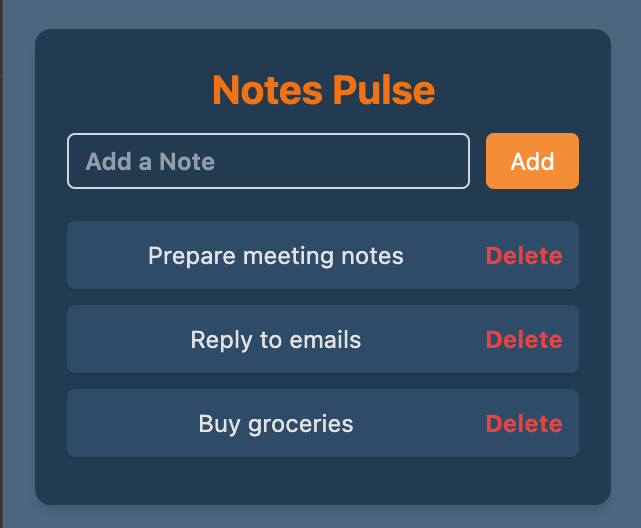
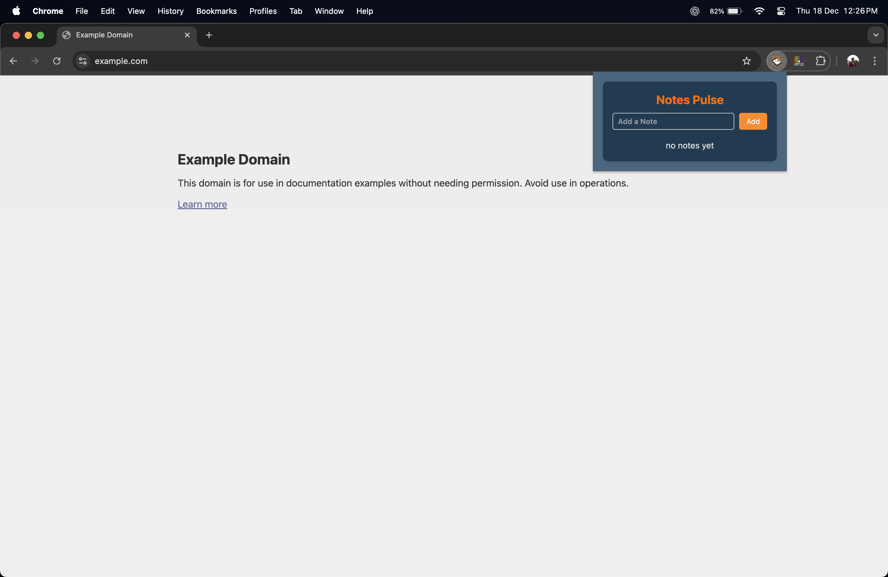
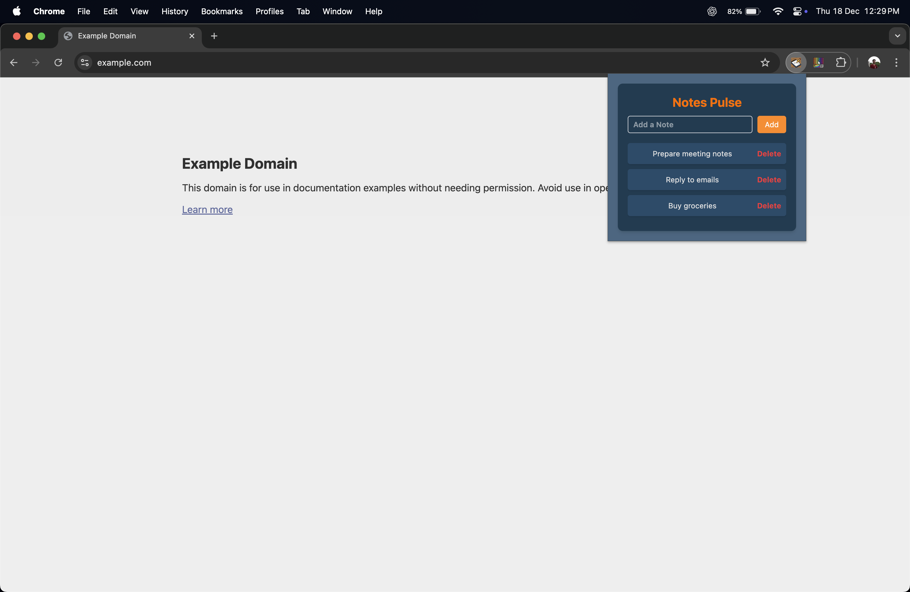
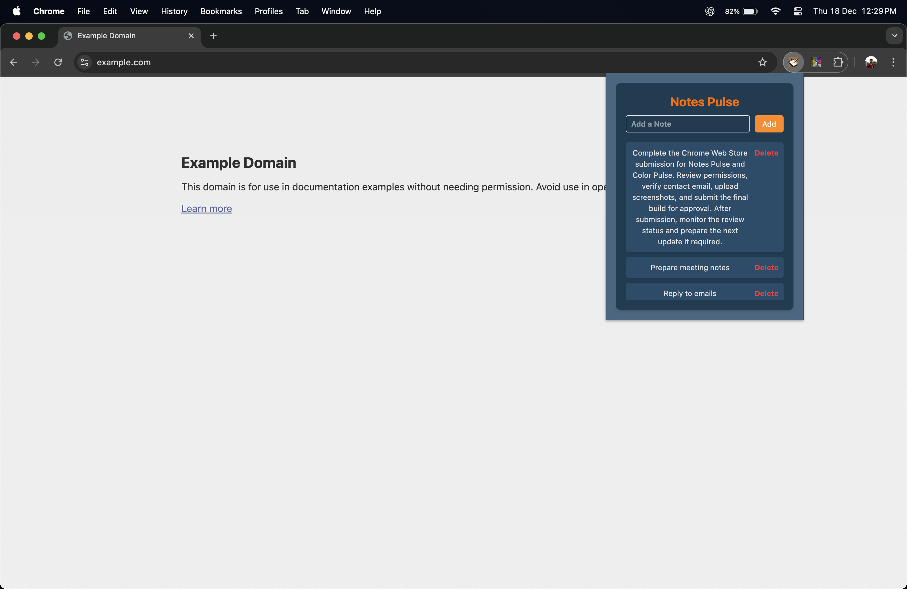

# Notes Pulse

Notes Pulse is a lightweight Chrome extension that allows users to quickly create store and manage short notes directly from the browser. Notes are saved automatically and remain available across browser sessions.

## Overview

Notes Pulse provides a simple popup interface where users can add short text notes and delete them when no longer needed. All notes are stored using Chrome storage so they persist even after the browser is closed.

The extension is designed to be fast minimal and distraction free making it suitable for quick thoughts reminders or temporary notes while browsing.

## Features

Add short notes instantly  
Automatically saves notes using Chrome storage  
Notes persist across browser sessions  
Delete notes easily  
Clean and minimal popup interface

## Tech Stack

TypeScript  
React  
Vite  
Tailwind CSS  
Chrome Extensions Manifest V3

## How It Works

When the extension loads it retrieves saved notes from chrome.storage.sync and displays them in the popup. Any changes to the notes list are automatically saved back to storage.

Each note is assigned a unique identifier and stored as plain text. All logic runs locally within the browser and no external services are used.

## Installation for Development

Clone the repository

git clone https://github.com/Shashwat-06/Notes-Pulse-Chrome-Extension.git

Install dependencies

npm install

Build the extension

npm run build

Load the extension in Chrome

Open chrome://extensions  
Enable Developer Mode  
Click Load unpacked  
Select the dist folder

## Screenshots

## Usage

Click the Notes Pulse extension icon  
Type a note in the input field  
Press Add to save the note  
Use the Delete button to remove notes

## Permissions Used

storage is used to save and retrieve notes locally using Chrome storage

## Privacy

Notes Pulse does not collect store or transmit any user data. All notes are stored locally in the browser using Chrome storage and are never sent to any external server.

## License

This project is open source and available under the MIT License.
